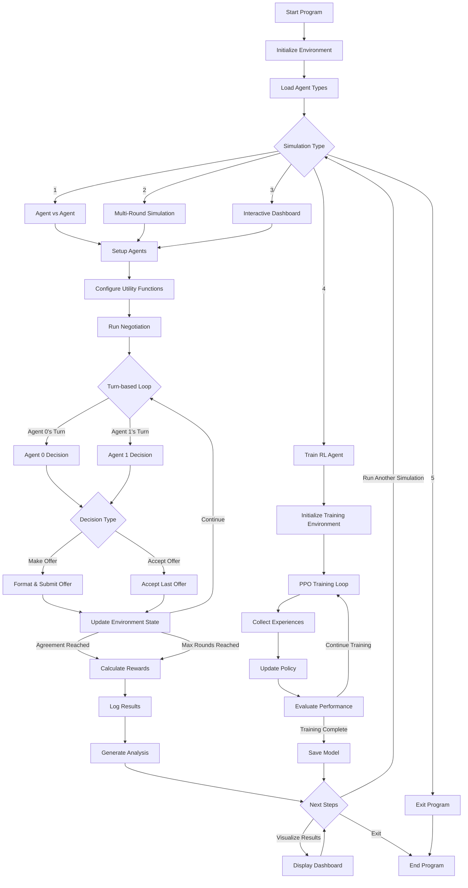

# 🤝 AI Negotiation Bots

This project explores multi-agent negotiation using autonomous agents with varying strategies — including RL-trained negotiators, cooperative bots, and adversarial agents. Simulations evaluate the ability to reach optimal agreements under dynamic utility conditions.

---

## 🎯 Objectives
- Build negotiation agents with diverse behaviors
- Train RL agents to maximize reward under uncertainty
- Simulate negotiations with multiple utility models
- Analyze results to find equilibrium and social welfare impacts

---

## 🧠 Agent Types
| Agent Type         | Strategy                      |
|--------------------|-------------------------------|
| RuleBasedAgent     | Fixed offer thresholds        |
| RLNegotiatorAgent  | PPO agent with utility maximization |
| CooperativeAgent   | Fair deal seeker              |
| AdversarialAgent   | Maximize gain, risk failure   |

---

## 🚀 Getting Started

```bash
# Create and activate a virtual environment (recommended)
python3 -m venv .venv
source .venv/bin/activate

# Install requirements
pip install -r requirements.txt
```

### Train the RL Agent
```bash
# Train for 100,000 steps (recommended)
python scripts/train_rl_agent.py
```

### Run Simulations
```bash
# RL vs Adversarial (with reasonable parameters)
python simulations/agent_vs_agent.py --agent1 rl --agent2 adversarial --agent2_config '{"high_threshold": 0.7, "low_offer": 0.7}'

# RL vs Cooperative
python simulations/agent_vs_agent.py --agent1 rl --agent2 cooperative

# Run multiple simulations for statistical significance
python simulations/agent_vs_agent.py --agent1 rl --agent2 adversarial --agent2_config '{"high_threshold": 0.7, "low_offer": 0.7}' --simulations 10
```

### Interactive Dashboard
```bash
# Launch the visual dashboard for easier interaction
streamlit run dashboard.py
```

---

## 🏆 Results & Findings

### RL Agent Performance
Our PPO-trained negotiation agent successfully learned effective negotiation strategies after 100,000 training steps:

- **Agreement Rate**: Successfully reaches agreements with reasonable adversarial agents
- **Utility Maximization**: Consistently accepts offers giving it more of the items it values
- **Learning Progression**: Clear improvement in negotiation success between 10K and 100K training steps

### Strategy Analysis
Different agent combinations revealed interesting negotiation patterns:

| Agent Pairing           | Notable Behaviors                                   |
|-------------------------|-----------------------------------------------------|
| RL vs. Adversarial      | Quick agreements when adversarial parameters are reasonable |
| RL vs. Cooperative      | Generally reaches fair deals                        |
| RL vs. Rule-based       | Depends on rule-based acceptance thresholds         |
| RL vs. RL               | Struggles with initial offers, both waiting to accept |

### Utility Function Impact
Agent performance varies significantly across different utility structures:
- **Complementary Preferences**: Highest agreement rate (agents want different items)
- **Competitive Preferences**: Lower agreement rate (agents want same items)

---

## 📊 Outputs
- CSV logs of each negotiation round saved to simulation_logs
- Summary statistics of agreement rates and rewards
- Visual dashboard for analyzing negotiation patterns

---

## ✅ Project Checklist
- [x] Create negotiation environment with reward signals
- [x] Implement baseline rule-based agent
- [x] Train RL-based negotiation agent (PPO)
- [x] Log negotiation outcomes for analysis
- [x] Create interactive dashboard
- [ ] Implement curriculum learning for better offering behavior
- [ ] Add multi-item (3+) negotiations
- [ ] Add communication/signaling between agents

---

## 📁 Folder Overview

| Folder             | Description                              |
|--------------------|------------------------------------------|           
| agents/            | All agent implementations                |
| environment/       | Negotiation gym-style environment        |
| simulations/       | Scripts to run agent-vs-agent scenarios  |
| models/            | RL policy models                         |
| logs/              | Simulation results and training logs     |
| scripts/           | Training and utility scripts             |

---

## 🧠 Known Limitations & Future Work

- **RL vs RL Issue**: Both agents tend to wait for the other to make offers
- **Limited Item Types**: Currently only supports 2 item types
- **Fixed Utility Functions**: Agents cannot infer opponent preferences

Future improvements:
- Implement preference inference
- Add more complex negotiation scenarios (3+ items)
- Develop better opening strategies for RL agents

---

## 🔄 System Flowchart & Overall Program Flow

```
┌──────────────────┐       ┌──────────────────────┐       ┌──────────────────┐
│                  │       │                      │       │                  │
│  Environment     │◄─────►│  Agent Environment   │◄─────►│  Agents          │
│  (PettingZoo)    │       │  Cycle (AECEnv)      │       │  (4 Types)       │
│                  │       │                      │       │                  │
└──────────────────┘       └──────────────────────┘       └──────────────────┘
        │                           │                             │
        │                           │                             │
        ▼                           ▼                             ▼
┌──────────────────┐       ┌──────────────────────┐       ┌──────────────────┐
│                  │       │                      │       │                  │
│  Observation     │       │  Action Selection    │       │  Utility         │
│  Space           │─────► │  & Decision-Making   │◄──────│  Functions       │
│                  │       │                      │       │                  │
└──────────────────┘       └──────────────────────┘       └──────────────────┘
                                     │
                                     │
                                     ▼
                           ┌──────────────────────┐
                           │                      │
                           │  Simulation Runner   │
                           │  & Analysis          │
                           │                      │
                           └──────────────────────┘
                                     │
                                     │
                                     ▼
                           ┌──────────────────────┐
                           │                      │
                           │  Dashboard &         │
                           │  Visualization       │
                           │                      │
                           └──────────────────────┘
```

## 🔄 Overall Program Flow



### Key Decision Points in the Flow

1. **Simulation Selection**:
   - Agent vs Agent: Direct 1v1 negotiation between two selected agent types
   - Multi-Round: Run many negotiations with the same agent pairing for statistical analysis
   - Interactive: Use the Streamlit dashboard for visualization and parameter tuning
   - Training: Train a new RL agent model using the PPO algorithm

2. **Agent Decision Process**:
   - Each agent receives an observation containing environment state
   - Decision logic varies by agent type:
     - Rule-based: Fixed threshold-based decisions
     - Adversarial: Maximize personal gain
     - Cooperative: Balance personal gain with opponent satisfaction
     - RL: Use trained neural network policy to determine actions

3. **Negotiation Outcomes**:
   - Agreement: Both agents reach mutually acceptable item distribution
   - No Agreement: Max rounds reached without acceptance
   - Utility Calculation: Determine reward based on each agent's preference function
